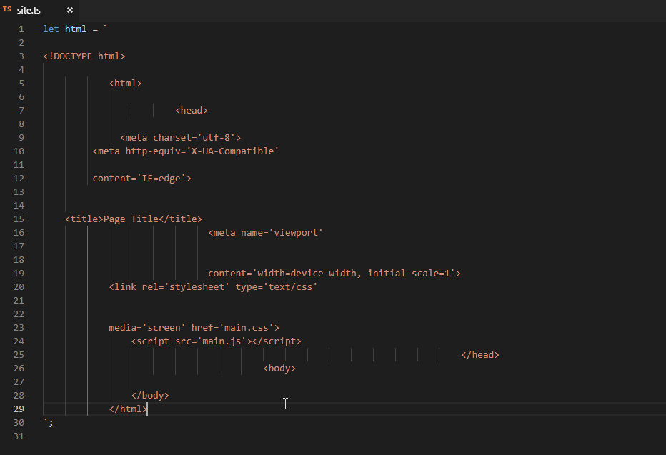

# Format Selection As HTML

Format selected text as HTML using Prettier. Useful for code embedded in strings or templating languages without formatting support (like Razor).

## Instruction

Use `Format Selection As HTML` command from context menu or Command Palette.

## Presentation

## Configuration

Exposes Prettier's HTML Whitespace Sensitivity and Print Width settings through `formatSelectionAsHtml.htmlWhitespaceSensitivity` and `formatSelectionAsHtml.printWidth` properties.
